# Criando uma API em poucos minutos em Node.js com STRAPI

## 1 - Softwares necessários

Neste tutorial eu não pretendo cobrir como instalar os seguintes softwares que serão necessários:
* [MongoDb](https://www.mongodb.com/)
* [Node.js](https://nodejs.org/en/)


<br />
<br />
<br />


## 2 - Primeiros passos

### 2.1 - Instalando o CLI

Para começar, vamos instalar o STRAPI globalmente

```shell
npm install strapi@alpha -g
```


<br />
<br />
<br />


### 2.2 - Iniciando o projeto

Assim que estiver finalizado, vamos criar um projeto novo com o nome "trivia"

```shell
strapi new trivia
```

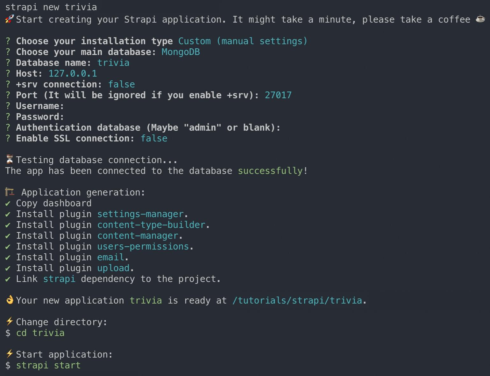

Conforme a imagem acima, a sequencia de escolhas foi a seguinte:
1. Choose your instalation type:
	* Custom (manual settings)
1. Choose your main database
	* MongoDB
1. Database name
	* trivia
1. Host:
	* 127.0.0.1
1. +srv connection
	* false
1. Port (it will be ignored if you enable +srv)
	* 27017
1. Username
	* vazio
1. Password
	* vazio
1. Authentication database (Maybe "admin" or blank)
	* vazio
1. Enable SSL connection
	* false


<br />
<br />
<br />


### 2.3 - Rodando o servidor localmente

```shell
cd trivia;
strapi start;
```

Se tudo deu certo, abra seu navegador e entre em http://localhost:1337/admin


<br />
<br />
<br />


### 2.4 - Configurando o administrador

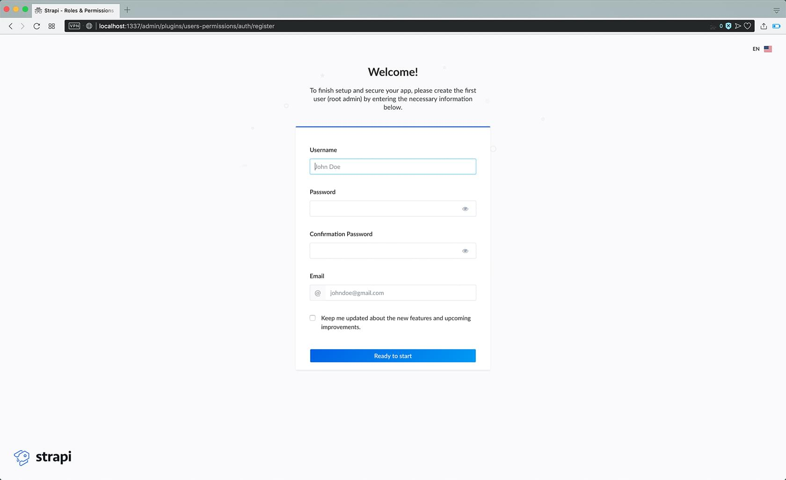

1. Defina o "login" / apelido do seu usuário, que será usado para autenticação sempre
1. Insira uma senha
1. Confirme a senha
1. Adicione um email para validar seu usuário
1. Click em "ready to start" para finalizar a instalação


<br />
<br />
<br />


## 3 - Conhecendo a STRAPI

### 3.1 - Painél de Administração

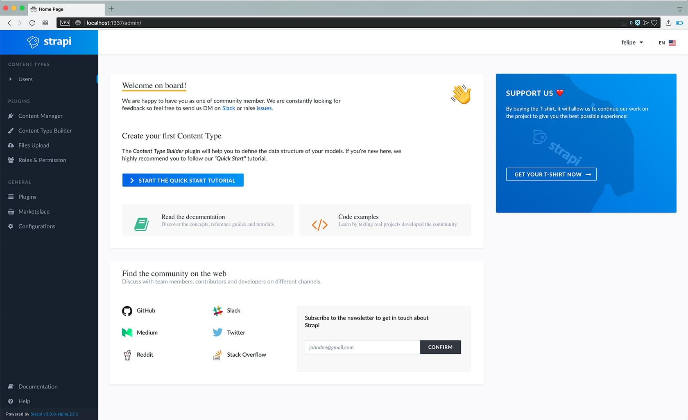

Essa é a principal visualização do CMS STRAPI.
<br />
Nele existe um menu de navegação à esquerda onde encontraremos tudo que vamos precisar neste tutorial.

<br />
<br />
<br />

## 4 - Adicionando Tipos de Conteúdo

* No painél de administração, no menu à esquerda, click em "Content Type Builder"


<br />
<br />
<br />


> * Em "Content Type Builder" (imagem abaixo), click em "Add Content Type" no canto superior direito 
> <br />
> 
> 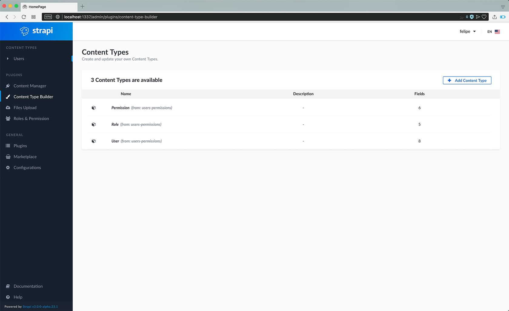


<br />
<br />
<br />


> * Uma modal irá aparecer, requisitando que dê um nome ao seu novo "Content Type"
> * Feito isso, click em "Save"
> <br />
> 
> 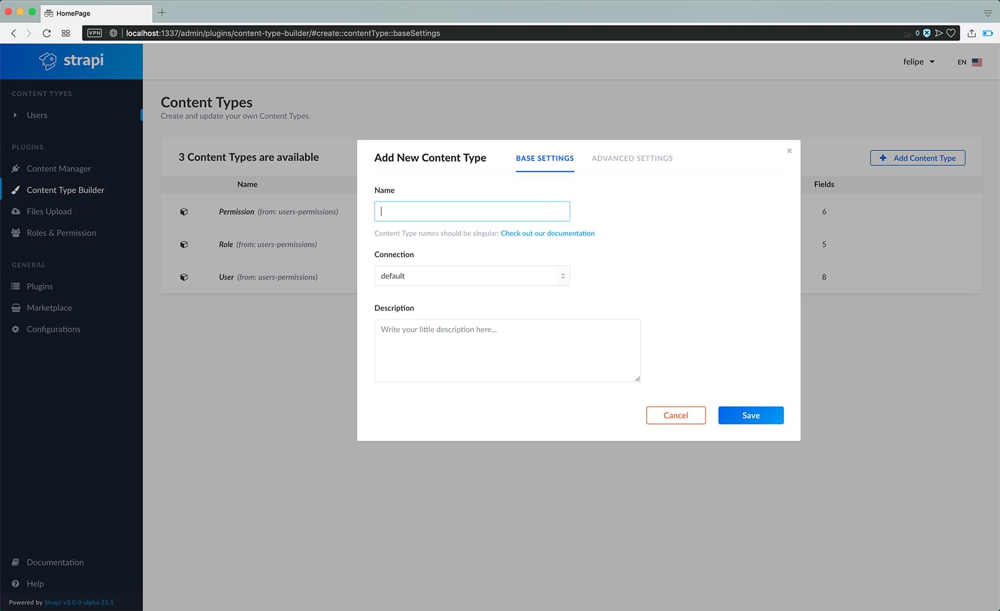


<br />
<br />
<br />

> * A tela vai mudar, a modal vai sumir e agora click em "Add new Field"
> <br />
> 
> 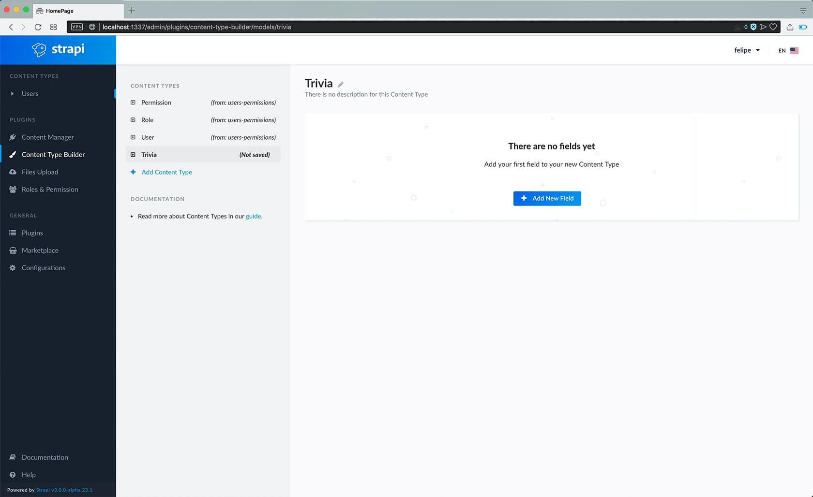


<br />
<br />
<br />

> * Uma extensa lista com tipos de campos vai aparecer. Para este tutorial, vou abordar inicialmente campos do tipo "String" e "Text"
> * Click em "String"
> <br />
> 
> 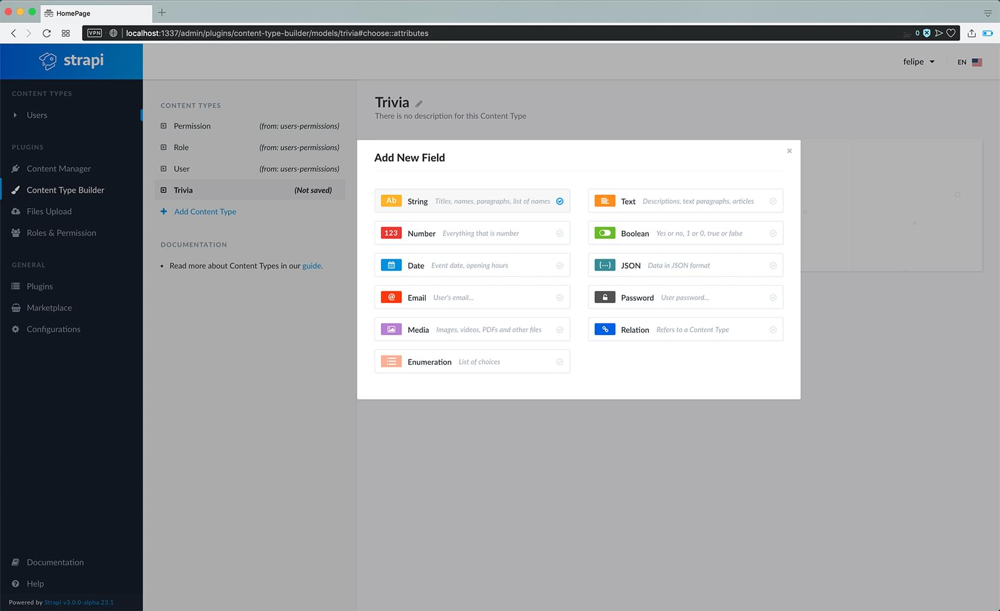


<br />
<br />
<br />

> * Na nova janela, coloque como nome do campo "trivia"
> * E depois na aba "Advanced Settings"
> <br />
> 
> 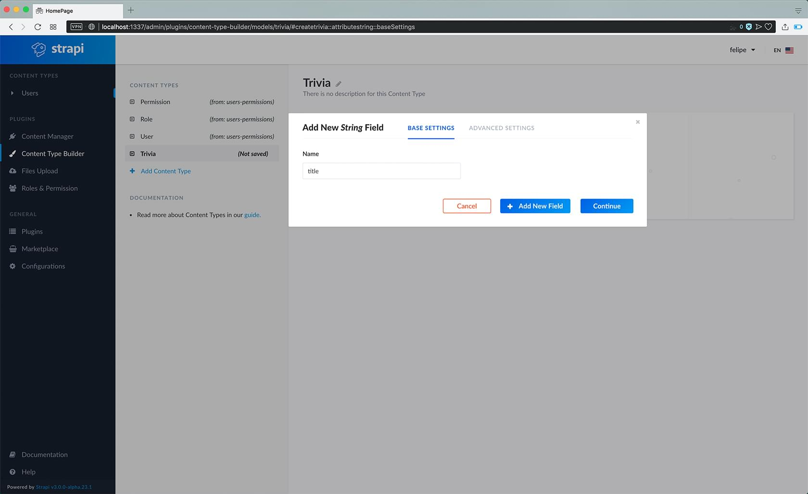


<br />
<br />
<br />


> * Na nova aba, marque:
>   * "Required Field"
>   * "Unique Field"
>   * Minimum Length
>     * 5
> * Click em "+ Add new field"
> <br />
>
> 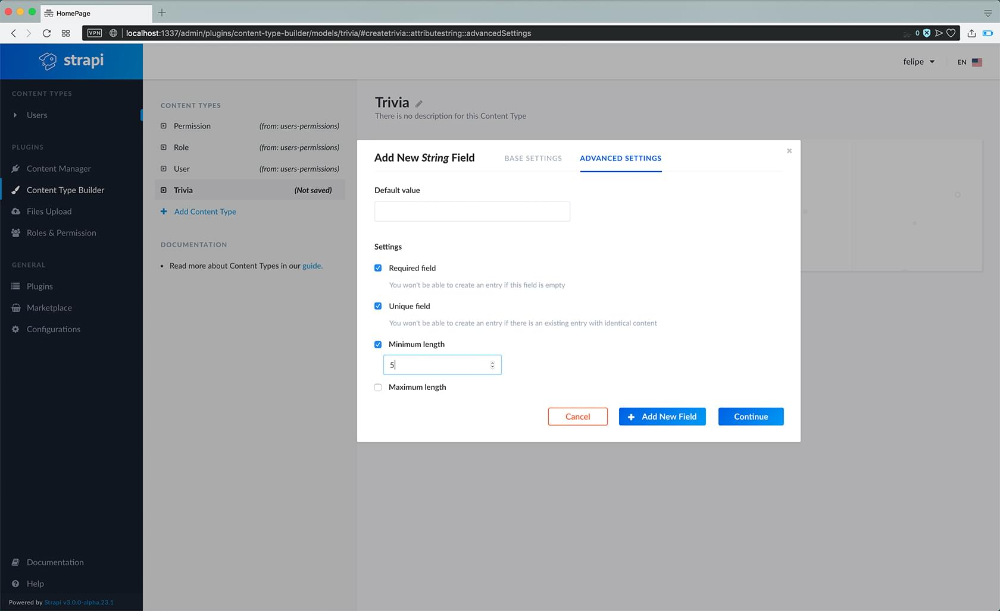


<br />
<br />
<br />


> * Voltamos a tela de tipos de campos, click em "Text"
> <br />
> 
> 


<br />
<br />
<br />


> * Na nova janela, coloque como nome do campo "descricao"
> * E depois na aba "Advanced Settings"
> <br />
> 
> 


<br />
<br />
<br />


> * Na nova aba, marque:
>   * "Display as a WYSIWYG"
> * Click em "Continue"
> <br />
> 
> 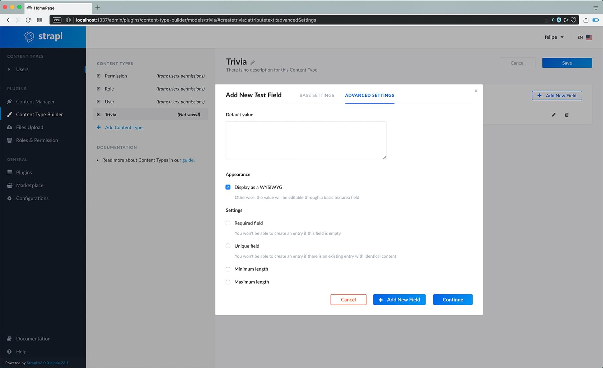


<br />
<br />
<br />

> * Agora que temos dois campos para o nosso tipo de conteúdo, click em "Save" no canto superior direito.
> <br />
> 
> 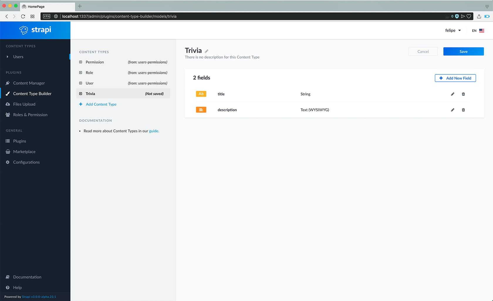


<br />
<br />
<br />


## 5 - Adicionando Conteúdo

Agora que temos um tipo de conteúdo "Trivia", podemos clicar no menu esquerdo em "Trivias", primeira opção em baixo de "Content Types"


<br />
<br />
<br />


> * Após entrar no menu de Trivias, click em "Add new Trivia" no canto superior direito
> 
> <br />
> 
> 

<br />
<br />
<br />

> * Dê um nome e uma descrição à sua nova entrada e click em "Save" no canto superior direito
> <br />
> 
> 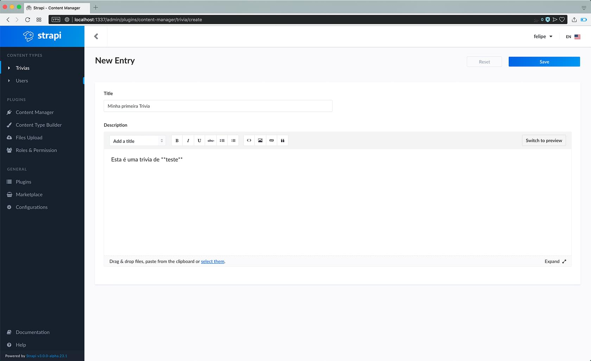

<br />
<br />
<br />


## 5 - Permissões da API