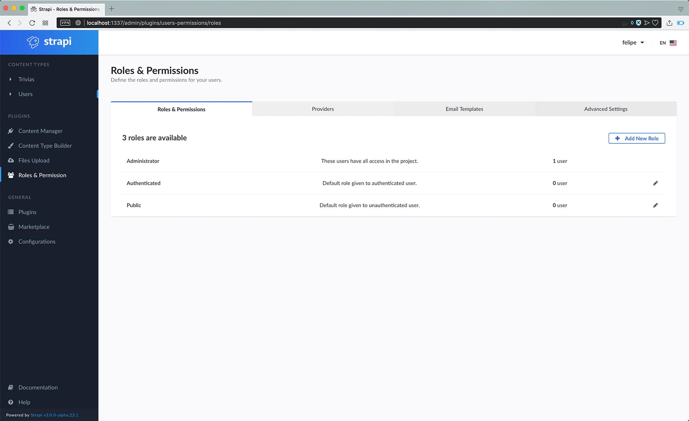
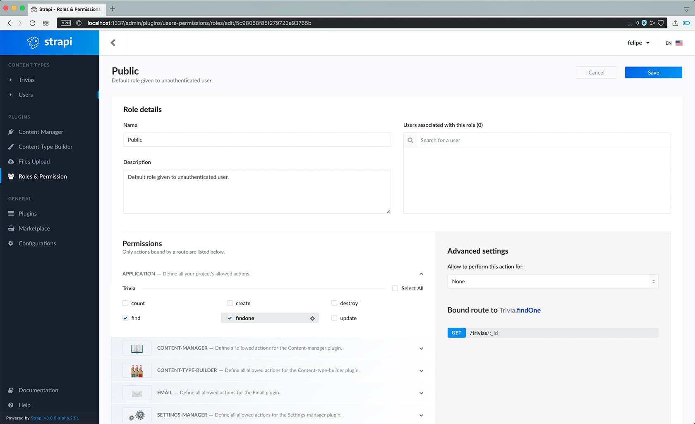
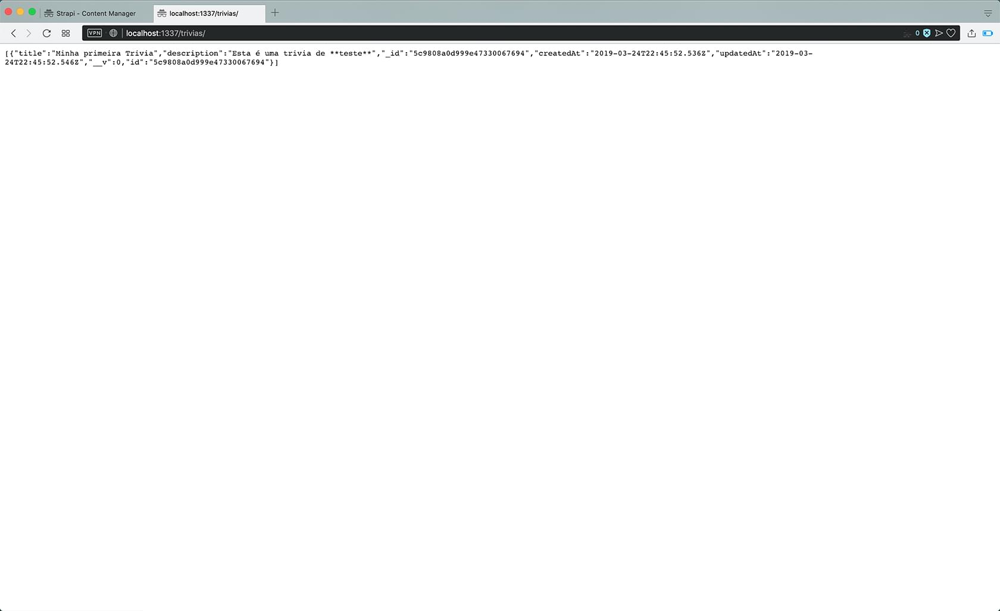
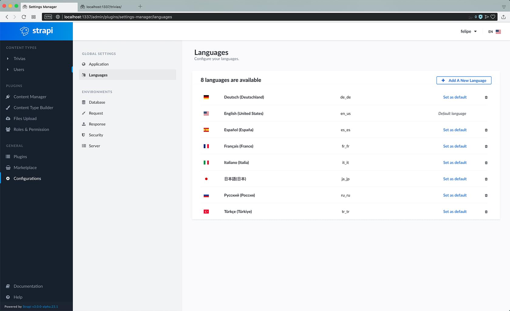
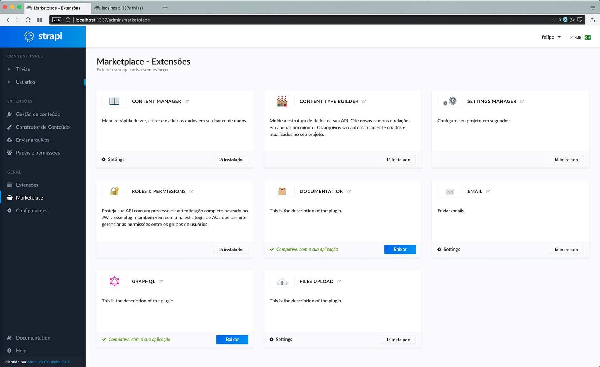

# Criando uma API em poucos minutos em Node.js com STRAPI


## Conteúdo

- [Criando uma API em poucos minutos em Node.js com STRAPI](#criando-uma-api-em-poucos-minutos-em-nodejs-com-strapi)
	- [Conteúdo](#conte%C3%BAdo)
	- [1 - Softwares necessários](#1---softwares-necess%C3%A1rios)
	- [2 - Primeiros passos](#2---primeiros-passos)
		- [2.1 - Instalando o CLI](#21---instalando-o-cli)
		- [2.2 - Iniciando o projeto](#22---iniciando-o-projeto)
		- [2.3 - Rodando o servidor localmente](#23---rodando-o-servidor-localmente)
		- [2.4 - Configurando o administrador](#24---configurando-o-administrador)
	- [3 - Conhecendo a STRAPI](#3---conhecendo-a-strapi)
		- [3.1 - Painél de Administração](#31---pain%C3%A9l-de-administra%C3%A7%C3%A3o)
	- [4 - Adicionando Tipos de Conteúdo](#4---adicionando-tipos-de-conte%C3%BAdo)
	- [5 - Adicionando Conteúdo](#5---adicionando-conte%C3%BAdo)
	- [6 - Permissões da API](#6---permiss%C3%B5es-da-api)
		- [6.1 - Dando/Removendo permissões](#61---dandoremovendo-permiss%C3%B5es)
		- [6.2 - Testando permissões](#62---testando-permiss%C3%B5es)
	- [7 - Bônus!](#7---b%C3%B4nus)
		- [7.1 - Suporte à outras linguas](#71---suporte-%C3%A0-outras-linguas)
		- [7.2 - Documentação](#72---documenta%C3%A7%C3%A3o)


## 1 - Softwares necessários

Neste tutorial eu não pretendo cobrir como instalar os seguintes softwares que serão necessários:
* [MongoDb](https://www.mongodb.com/)
* [Node.js](https://nodejs.org/en/)


<br />
<br />
<br />


## 2 - Primeiros passos

### 2.1 - Instalando o CLI

Para começar, vamos instalar o STRAPI globalmente

```shell
npm install strapi@alpha -g
```


<br />
<br />
<br />


### 2.2 - Iniciando o projeto

Assim que estiver finalizado, vamos criar um projeto novo com o nome "trivia"

```shell
strapi new trivia
```


Conforme a imagem acima, a sequencia de escolhas foi a seguinte:
1. Choose your instalation type:
	* Custom (manual settings)
1. Choose your main database
	* MongoDB
1. Database name
	* trivia
1. Host:
	* 127.0.0.1
1. +srv connection
	* false
1. Port (it will be ignored if you enable +srv)
	* 27017
1. Username
	* vazio
1. Password
	* vazio
1. Authentication database (Maybe "admin" or blank)
	* vazio
1. Enable SSL connection
	* false


<br />
<br />
<br />


### 2.3 - Rodando o servidor localmente

```shell
cd trivia;
strapi start;
```

Se tudo deu certo, abra seu navegador e entre em http://localhost:1337/admin


<br />
<br />
<br />


### 2.4 - Configurando o administrador


1. Defina o "login" / apelido do seu usuário, que será usado para autenticação sempre
1. Insira uma senha
1. Confirme a senha
1. Adicione um email para validar seu usuário
1. Clique em "ready to start" para finalizar a instalação


<br />
<br />
<br />


## 3 - Conhecendo a STRAPI

### 3.1 - Painél de Administração


Essa é a principal visualização do CMS STRAPI.
<br />
Nele existe um menu de navegação à esquerda onde encontraremos tudo que vamos precisar neste tutorial.

<br />
<br />
<br />

## 4 - Adicionando Tipos de Conteúdo

* No painél de administração, no menu à esquerda, clique em "Content Type Builder"


<br />
<br />


> * Em "Content Type Builder" (imagem abaixo), clique em "Add Content Type" no canto superior direito 
> <br />
> 
> 


<br />
<br />
<br />


> * Uma modal irá aparecer, requisitando que dê um nome ao seu novo "Content Type"
> * Feito isso, clique em "Save"
> <br />
> 
> 


<br />
<br />
<br />

> * A tela vai mudar, a modal vai sumir e agora clique em "Add new Field"
> <br />
> 
> 


<br />
<br />
<br />

> * Uma extensa lista com tipos de campos vai aparecer. Para este tutorial, vou abordar inicialmente campos do tipo "String" e "Text"
> * Clique em "String"
> <br />
> 
> 


<br />
<br />
<br />

> * Na nova janela, coloque como nome do campo "trivia"
> * E depois na aba "Advanced Settings"
> <br />
> 
> 


<br />
<br />
<br />


> * Na nova aba, marque:
>   * "Required Field"
>   * "Unique Field"
>   * Minimum Length
>     * 5
> * Clique em "+ Add new field"
> <br />
>
> 


<br />
<br />
<br />


> * Voltamos a tela de tipos de campos, clique em "Text"
> <br />
> 
> 


<br />
<br />
<br />


> * Na nova janela, coloque como nome do campo "descricao"
> * E depois na aba "Advanced Settings"
> <br />
> 
> 


<br />
<br />
<br />


> * Na nova aba, marque:
>   * "Display as a WYSIWYG"
> * Clique em "Continue"
> <br />
> 
> 


<br />
<br />
<br />

> * Agora que temos dois campos para o nosso tipo de conteúdo, clique em "Save" no canto superior direito.
> <br />
> 
> 


<br />
<br />
<br />


## 5 - Adicionando Conteúdo

Agora que temos um tipo de conteúdo "Trivia", podemos clicar no menu esquerdo em "Trivias", primeira opção em baixo de "Content Types"


<br />
<br />


> * Após entrar no menu de Trivias, clique em "Add new Trivia" no canto superior direito
> 
> <br />
> 
> 

<br />
<br />
<br />

> * Dê um nome e uma descrição à sua nova entrada e clique em "Save" no canto superior direito
> <br />
> 
> 

<br />
<br />
<br />


## 6 - Permissões da API

### 6.1 - Dando/Removendo permissões

Agora que temos um tipo de conteúdo "Trivia", podemos clicar no menu esquerdo em "Roles & Permissions", na seção de "Plugins"


<br />
<br />


> * Na seção de "Roles & Permissions", na lista de tipos de usuários, clique no ícone de lápis, na direita, na linha do tipo "Public"
> 
> <br />
> 
> 


<br />
<br />
<br />


> * Do meio da tela para baixo, na zona de "Permissions", existe uma lista de check-boxes para o tipo de conteúdo "Trivia", marque:
>   * find
>   * findone
> * Clique em "Save" no campo superior direito da tela
> 
> <br />
> 
> 


<br />
<br />
<br />


### 6.2 - Testando permissões


Se você seguiu os passos das seções:

* [5 - Adicionando Conteúdo](#5---adicionando-conteúdo)
* [6.1 - Dando/Removendo permissões](#61---dandoremovendo-permissões)


<br />
<br />


> * Em uma nova aba, acesse http://localhost:1337/trivias/
> * A Trivia criada deve ser acessível via "API"
> 
> <br />
> 
> 

<br />
<br />
<br />


## 7 - Bônus!

### 7.1 - Suporte à outras linguas


Zuntini, você está de sacanagem que você me fez seguir o tutorial todo em inglês quando havia uma opção para traduzir o painél todo para português!
<br />
Sim, fiz!
<br />
Uma vez que o que vou mostrar a seguir só funciona para a interface e não para os plugins ou para todas as partes do sistema, preferi usar a interface em inglês para o tutorial ;p


<br />
<br />

> * No menu lateral esquerdo, opção "Configuration", na aba "Language", existem algumas das linguas que podem ser usada para grande parte do sistema
> * Mas no canto superior direito, ao lado do nome do seu usuário (no meu caso, felipe), existe uma bandeira, clique nela e selecione pt-br
> 
> <br />
> 
> 


<br />
<br />
<br />

> * Deixando assim a bandeira verde e amarela selecionada e grande parte da interface em nossa língua maravilhosa
> 
> <br />
> 
> 


<br />
<br />
<br />


### 7.2 - Documentação


No menu lateral esquerdo, na opção "Marketplace" é possível encontrar vários plugins legais para a STRAPI

<br />
<br />

> * Um deles é o plugin de documentação, que gera uma documentação no visual SWAGGER, que pode ou não ser aberta (dá para colocar senha) - mas que não pretendo me aprofundar muito
> 
> <br />
> 
> 
